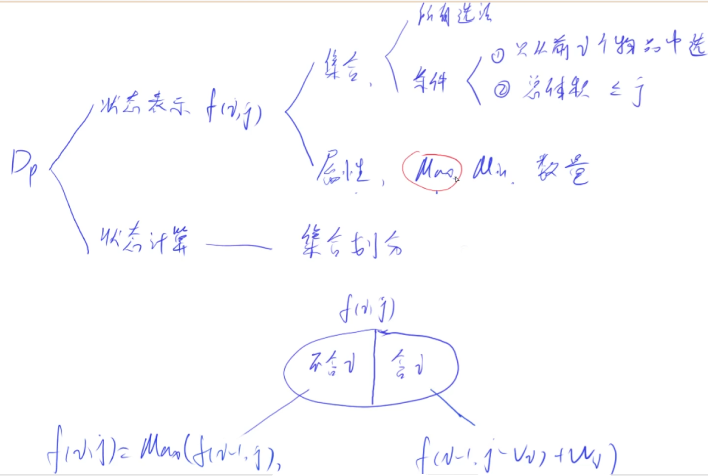
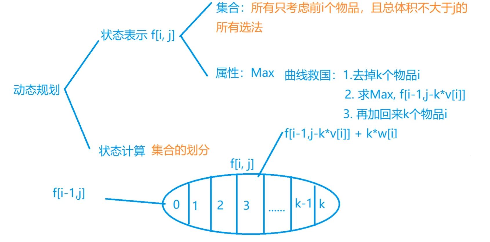
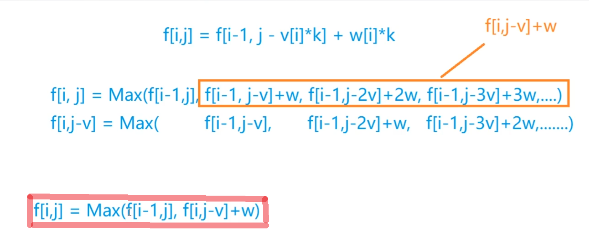

## 背包

### 01背包

### 完全背包

### 状态转移方程对比

### 多重背包

状态转移方程：` f[i,j] = max(f[i-1], f[i - 1][j - k*v[i]] + k * w[i])`    ( k属于0到s[i] )

时间复杂度(nWS)

二进制优化：将s拆成几段，将这每一段物品打包，dp时不用每个物品而是分段打包后的物品，每一段会摊销时间复杂度

拆成2，4，6，8，...，2^k，c      S不一定为2^k，剩余部分用c补充

时间复杂度(nWlogS)

