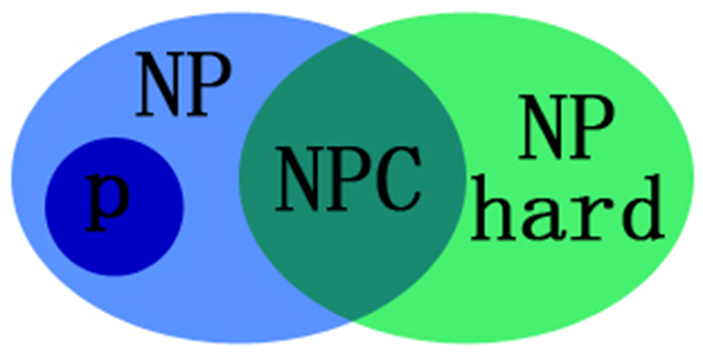
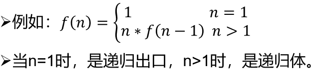
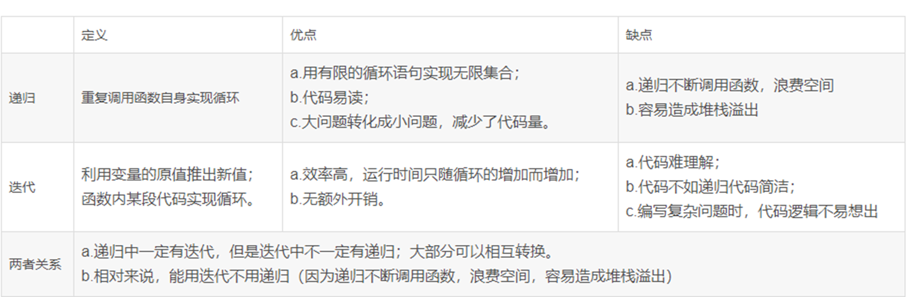

# 算法期末复习

#### 碎碎念

鉴于李姐每次重点都跟没画一样，花了一天搞了这个

我愿称之为408式语文化期末特化面向课后题式复习喵

没提到的，有错误的看她ppt和课本吧

模板本来想着把我自己板子放上来，但是懒得整理所以鸽了，有空更上~~其实已经更了一大堆了，都在模板文件夹里~~

只是自己的总结，不存在我被提前透题了~~要是有我早偷偷用了~~

点个star谢谢喵

优先3，4，7，8

5，6会bfs、dfs、相关概念即可

1，2相关概念，计算

---


### 复习ppt提到的问题

- 01背包
- 完全背包
- 大整数乘法  矩阵乘法
- 最大子序列和（已更新）
- 最长公共子序列
-  [N皇后.cpp](模板\DFS\N皇后.cpp) 
- 幂集
- 活动安排
- 各种排序
  -  [归并排序.cpp](模板\归并排序.cpp) 
  -  [快速排序.cpp](模板\快速排序.cpp) 
  - ...

-  [整数二分.cpp](模板\整数二分.cpp) 

---


## 第三章 分治法


### 相关概念

对于一个规模为n的问题：若该问题可以容易地解决（比如说规模n较小）则直接解决，否则将其分解为k个规模较小的子问题，这些子问题互相独立且与原问题形式相同，递归地解这些子问题，然后将各子问题的解合并得到原问题的解。这种算法设计策略叫做***分治法***。


### 应用条件

分治法所能解决的问题一般具有以下几个特征：

1. 该问题的规模缩小到一定的程度就可以容易地解决。
2. 该问题可以分解为若干个规模较小的相同问题。
3. 利用该问题分解出的子问题的解可以合并为该问题的解。
4. 该问题所分解出的各个子问题是相互独立的，即子问题之间不包含公共的子问题。


### 求解过程

分治法通常采用递归算法设计技术，在每一层递归上都有3个步骤：

1. 分解：将原问题分解为若干个规模较小，相互独立，与原问题形式相同的子问题。
2. 求解子问题：若子问题规模较小而容易被解决则直接求解，否则递归地求解各个子问题。
3. 合并：将各个子问题的解合并为原问题的解。


### 算法框架

```c++
divide_and_conquer(P)
{  
   if |P| <= n0 return adhoc(P);
   将P分解为较小的子问题 P1, P2, …, Pk;
   for(i = 1; i <= k; i++)    //循环处理k次
      yi = divide_and_conquer(Pi);    //递归解决Pi
　　return merge(y1, y2, …, yk);    //合并子问题
}
```


### 模板

1. [快速排序.cpp](模板\快速排序.cpp)   O(nlogn)

2. [归并排序.cpp](模板\归并排序.cpp)   O(nlogn)

3. [逆序对的数量.cpp](模板\逆序对的数量.cpp)   O(nlogn)

4. [查找最大和次大元素.cpp](模板\查找最大和次大元素.cpp) O(n)

5. [整数二分.cpp](模板\整数二分.cpp)   O(logn)

6. [寻找一个序列中第k小元素](模板\寻找第k小的元素.md) O(n)

7. [寻找两个等长有序序列的中位数](模板\寻找两个等长有序序列的中位数.md) O(logn)

8. 最大连续子序列和(线段树) 时间O(n) 空间O(logn)

9. 棋盘覆盖

10.  循环日程安排

11.  大整数乘法和矩阵乘法

​    

---


## 第四章 蛮力法


### 相关概念

蛮力法是一种简单直接地解决问题的方法，通常直接基于问题的描述和所涉及的概念定义，找出所有可能的解。

然后选择其中的一种或多种解，若该解不可行则试探下一种可能的解。


### 应用条件

使用蛮力法通常有如下几种情况：

1. 搜索所有的解空间：问题的解存在于规模不大的解空间中。
2. 搜索所有的路径：这类问题中不同的路径对应不同的解。
3. 直接计算：按照基于问题的描述和所涉及的概念定义，直接进行计算。往往是一些简单的题，不需要算法技巧的。
4. 模拟和仿真：按照求解问题的要求直接模拟或仿真即可。


### 求解过程

在直接采用蛮力法设计算法中，主要是使用循环语句和选择语句，循环语句用于穷举所有可能的情况，而选择语句判定当前的条件是否为所求的解。


### 算法框架

```cpp
for (循环变量x取所有可能的值) 
{   
	...
    if (x满足指定的条件)
        输出x;
    ...
}
```


### 模板

1. 简单选择排序
2. 冒泡排序
3. 字符串匹配BF算法
4. 求最大连续子序列和 O(n^3)~O(n)
5. 幂集 O(n*2^n)~O(2^n)
6. 简单0/1背包问题 O(2^n)
7. [全排列.cpp](模板\DFS\全排列.cpp)  O(n*n!)
8. 任务分配 （全排列）
9. 递归在暴力中的应用
10.   DFS
11.   BFS


---


## 第五章 回溯法


### 相关概念

***问题的解空间***

一个复杂问题的解决方案是由若干个小的决策步骤组成的决策序列，解决一个问题的所有可能的决策序列构成该问题的**解空间**。在一般情况下，问题的解仅是问题解空间的一个子集。


问题的解由一个不等长或等长的解向量X={x1，x2，…，xn}组成，其中分量xi表示第i步的操作。

所有满足约束条件的解向量组构成了问题的**解空间**。

问题的解空间一般用树形式来组织，也称为**解空间树**或**状态空间**，树中的每一个结点确定所求解问题的一个问题状态。

树的根结点位于第1层，表示搜索的初始状态，第2层的结点表示对解向量的第一个分量做出选择后到达的状态，以此类推。


解空间中满足约束条件的决策序列（解空间）称为***可行解***。

解空间中在约束条件下使目标达到最优的可行解称为该问题的***最优解***。


解空间树通常有两种类型：

***子集树***：当所给的问题是从n个元素的集合S中找出满足某种性质的子集时，相应的解空间树称为子集树。　

***排列树***：当所给的问题是确定n个元素满足某种性质的排列时，相应的解空间树称为排列树。　

(问题的解空间树是虚拟的)


***回溯法***：

在包含问题的所有解的解空间树中，按照深度优先搜索的策略，从根结点（开始结点）出发搜索解空间树。

首先根结点成为活结点（活结点是指自身已生成但其孩子结点没有全部生成的结点），同时也成为当前的扩展结点（扩展结点是指正在产生孩子结点的结点）。

在当前的扩展结点处，搜索向纵深方向移至一个新结点。这个新结点就成为新的活结点，并成为当前扩展结点。

如果在当前的扩展结点处不能再向纵深方向移动，则当前扩展结点就成为死结点（死结点是指由根结点到该结点构成的部分解不满足约束条件，或者其子结点已经搜索完毕）。

此时应往回移动（回溯）至最近的一个活结点处，并使这个活结点成为当前的扩展结点。

回溯法以这种方式递归地在解空间中搜索，直至找到所要求的解或解空间中已无活结点为止。


回溯法搜索解空间时，通常采用***两种策略避免无效搜索***，提高回溯的搜索效率:　

用***约束函数***在扩展结点处剪除不满足约束的子树；

用***限界函数***剪去得不到问题解或最优解的子树。

这两类函数统称为***剪枝函数***。


**回溯法 = 深度优先搜索 + 剪枝**


### 应用条件

用回溯法求解的问题可以分为两种，一种是求一个（或全部）可行解，另一种是求最优解。

在解存在的空间中寻找解（搜索）


### 求解过程

用回溯法解题的一般步骤如下：

1. 确定问题的解空间树，问题的解空间树应至少包含问题的一个（最优）解。
2. 确定结点的扩展规则。
3. 以深度优先方式搜索解空间树，并在搜索过程中可以采用剪枝函数来避免无效搜索。


### 算法框架

1. 非递归回溯框架

   ```c++
   int x[n];				//x存放解向量，全局变量
   void backtrack(int n)			//非递归框架
   {
   	int i = 1;				//根结点层次为1
   	while (i >= 1)			//尚未回溯到头
   	{
   		if(ExistSubNode(t)) 		//当前结点存在子结点
   		{
   			for (j = 下界; j <= 上界; j++) 	//对于子集树，j=0到1循环
   			{
   				x[i]取一个可能的值;
   				if (constraint(i) && bound(i)) //x[i]满足约束条件或界限函数
               	{
                   	if (x是一个可行解)
   						输出x;
                       else i++;		//进入下一层次
   	     		}
            	}
           }
   		else i--;			//回溯：不存在子结点，返回上一层
   	}
   }
   ```

2. 递归的算法框架

   1. 解空间为子集树

      ```c++
      int x[n];			   //x存放解向量，全局变量
      void backtrack(int i)		   //求解子集树的递归框架
      {
      	if (i > n)			   //搜索到叶子结点,输出一个可行解
      		输出结果;
      	else
      	{
      		for (j = 下界; j <= 上界; j++)   //用j枚举i所有可能的路径
              {
      			x[i] = j;		   //产生一个可能的解分量
      			…			   //其他操作
      			if (constraint(i) && bound(i))
      				backtrack(i + 1);	   //满足约束条件和限界函数,继续下一层
      		}
      	}
      }
      ```

   2. 解空间为排列树

      ```c++
      int x[n];			//x存放解向量，并初始化
      void backtrack(int i)		//求解排列树的递归框架
      {
      	if (i > n)			//搜索到叶子结点,输出一个可行解
      		输出结果;
      	else
          {
              for (j = i; j <= n; j++)	//用j枚举i所有可能的路径
      		{  
      			…			//第i层的结点选择x[j]的操作
      			swap(x[i], x[j]);	//为保证排列中每个元素不同,通过交换来实现
      			if (constraint(i) && bound(i))
      			backtrack(i + 1);	//满足约束条件和限界函数，进入下一层
      			swap(x[i], x[j]);	//恢复状态
      			…			//第i层的结点选择x[j]的恢复操作
              }
          }
      }
      ```


### 回溯法与深度优先遍历的异同

两者的**相同点**：

回溯法在实现上也是遵循深度优先的，即一步一步往前探索，而不像广度优先遍历那样，由近及远一片一片地搜索。

两者的**不同点**：

1. 访问序不同：深度优先遍历目的是“遍历”，本质是无序的。而回溯法目的是“求解过程”，本质是有序的。
2. 访问次数的不同：深度优先遍历对已经访问过的顶点不再访问，所有顶点仅访问一次。而回溯法中已经访问过的顶点可能再次访问。
3. 剪枝的不同：深度优先遍历不含剪枝，而很多回溯算法采用剪枝条件剪除不必要的分枝以提高效能。


### 回溯法算法的时间分析

通常以回溯算法的解空间树中的结点数作为算法的时间分析依据，假设解空间树共有*n*层。

- 第1层有*m*0个满足约束条件的结点，每个结点有*m*1个满足约束条件的结点；
- 第2层有*m*0*m*1个满足约束条件的结点，同理，第3层有*m*0*m*1*m*2个满足约束条件的结点。
- 第*n*层有*m*0*m*1…*m*n-1个满足约束条件的结点，则采用回溯法求所有解的算法的执行时间为　T(*n*)=*m*0+*m*0*m*1+*m*0*m*1*m*2+…+*m*0*m*1*m*2…*m*n-1。

通常情况下，回溯法的效率会高于蛮力法。


### 模板

1. 01背包  O(2^n)
2. 装载问题
3. 子集和  O(2^n)
4. [N皇后.cpp](模板\DFS\N皇后.cpp)   O(n^n)
5. 图的m着色问题  O(m^n)
6. 任务分配  O(n^n)
7. 活动安排  O(n!)
8. 流水作业调度  O(n!)


---


## 第六章 分枝限界法


### 相关概念

***分枝限界法***：

分枝限界法类似于回溯法，也是一种在问题的解空间树上搜索问题解的算法。

分枝限界法与回溯法的**求解目标不同**：

回溯法的求解目标是找出解空间树中满足约束条件的所有解；

分枝限界法的求解目标则是找出满足约束条件的一个解，或是在满足约束条件的解中找出使某一目标函数值达到极大或极小的解，即在某种意义下的最优解。


“分枝”就是采用***广度优先***的策略，依次搜索活结点的所有分枝，也就是所有相邻结点。

求最优解时，选择哪一个子结点？

采用一个**限界函数**，计算限界函数值，选择一个最有利的子结点作为扩展结点，使搜索朝着解空间树上有最优解的分枝推进，以便尽快地找出一个最优解。


**分枝限界法 = 广度优先搜索 + 限界函数**


### 分枝限界法与回溯法的**主要区别**

| **方法**       | **解空间搜索方式** | **存储结点的数据结构** | **结点存储特性**                           | **常用应用**                           |
| -------------- | ------------------ | ---------------------- | ------------------------------------------ | -------------------------------------- |
| **回溯法**     | 深度优先           | 栈                     | 活结点的所有可行子结点被遍历后才从栈中出栈 | 找出满足条件的所有解                   |
| **分枝限界法** | 广度优先           | 队列，优先队列         | 每个结点只有一次成为活结点的机会           | 找出满足条件一个解或者特定意义的最优解 |


**分枝限界法和回溯法实际上都属于穷举法**，当然不能指望有很好的最坏时间复杂度，**在最坏情况下，时间复杂性是指数阶。**

分枝限界法的较高效率是以付出一定代价为基础的，其工作方式也造成了算法设计的复杂性。另外，算法要维护一个活结点表（队列），并且需要在该表中快速查找取得极值的结点，这都需要较大的存储空间，**在最坏情况下，分枝限界法需要的空间复杂性是指数阶。**

归纳起来，与回溯法相比，**分枝限界法算法的优点是可以更快地找到一个解或者最优解**，其**缺点是要存储结点的限界值等信息，占用的内存空间较多。**另外，求解效率基本上由限界函数决定，**若限界估计不好，在极端情况下将与穷举搜索没多大区别。**


### 应用条件

类似回溯法


### 求解过程

1. 设计合适的限界函数
2. 组织活结点表
   - 队列式分枝限界法
   - 优先队列式分枝限界法
3. 确定最优解的解向量
   - 对每个扩展结点保存从根结点到该结点的路径
   - 在搜索过程中构建搜索经过的树结构


### 算法框架

```cpp
Q = {q0};//存储所有的活结点,初始化为根节点
void Branch&Bound ()
{
	while (Q != ?) 
	{
		select a node q from Q;  //从Q选择一个结点
		Branch(q, Q1);  //对q进行分支，产生Q1，分支时利用约束和界进行剪枝
		add(Q1, Q);  // 将新产生的活结点加入Q
    }
}
```


### 模板

 [迷宫.cpp](模板\BFS\迷宫.cpp) 

1. 01背包  O(2*n*)
2. 图的单源最短路径
3. 任务分配
4. 流水作业调度


TSP


---


## 第七章 贪心法


### 相关概念

贪心法的基本思路是在对问题求解时总是做出在当前看来是最好的选择，也就是说贪心法不从整体最优上加以考虑，所做出的仅是在某种意义上的局部最优解。

人们通常希望找到整体最优解，所以采用贪心法需要证明设计的算法确实是整体最优解或求解了它要解决的问题。


***可行解***：求解问题时，直接给出或可以分析出某些约束条件，满足约束条件的问题解成为可行解。

***最优解***：求解问题直接给出或者分析出衡量可行解好坏的目标函数，使目标函数取得最大（或最小）的可行解成为最优解。


在贪心算法中，需要注意的问题：

1. 不能保证求得的最后解是最佳的
2. 只能求满足某些约束条件的可行解的范围
3. 开弓没有回头箭：一旦做出选择，不可以反悔
4. 有可能得到不是最优解，而是近似最优解


贪心法从问题的某一个初始解{}出发，采用逐步构造最优解的方法向给定的目标前进，每一步决策产生*n*-元组解（*x*0，*x*1，…，*x*n-1）的一个分量。

贪心法每一步上用作决策依据的选择准则被称为***最优量度标准***（或***贪心准则***），也就是说，在选择解分量的过程中，添加新的解分量*x*k后，形成的部分解（*x*0，*x*1，…，*x*k)不违反可行解约束条件。

每一次贪心选择都将所求问题简化为规模更小的子问题，并期望通过每次所做的局部最优选择产生出一个全局最优解。


***贪心选择性质***：

是指所求问题的整体最优解可以通过一系列局部最优的选择（即贪心选择）来达到。也就是说，贪心法仅在当前状态下做出最好选择，即局部最优选择，然后再去求解做出这个选择后产生的相应子问题的解。

它是贪心法可行的第一个基本要素，也是贪心算法与后面介绍的动态规划算法的主要区别。（数学归纳法）

***最优子结构性质***：

如果一个问题的最优解包含其子问题的最优解，则称此问题具有最优子结构性质。

问题的最优子结构性质是该问题可用动态规划算法或贪心法求解的关键特征。（反证法）


### 应用条件

1. 该问题的全局最优解可以通过一步又一步获取的多个局部最优解而得到。 
2. 该问题包含多个子问题，而对子问题求解最优解有助于得到该问题的最优解。


### 求解过程

从问题的某一个初始解出发逐步逼近给定的目标，以尽可能快的地求得更好的解。当达到算法中的某一步不能再继续前进时，算法停止。

1. 建立数学模型描述问题
2. 把求解的问题分成若干个子问题
3. 对每一个子问题进行求解，得到子问题的局部最优解
4. 把子问题的局部最优解合成原来问题的一个解


### 算法框架

```cpp
SolutionType Greedy(SType a[],int n)
//假设解向量(x0,x1,…,xn-1)类型为SolutionType，其分量为SType类型
{  
    SolutionType x = {}；		  //初始时，解向量不包含任何分量
    for (int i = 0; i < n; i++)	  //执行n步操作
    {  
        SType xi = Select(a);	  //从输入a中选择一个当前最好的分量
        if (Feasiable(xi))	  //判断xi是否包含在当前解中
        solution = Union(x, xi);	  //将xi分量合并形成x 
    }
    return x;			  //返回生成的最优解
}
```


### 模板

1. 活动安排 O(nlogn)
2. 背包 O(nlogn)
3. 最优装载 O(nlogn)
4. 田忌赛马 O(nlogn)
5. 多机器调度 (NP，近似最优)  O(nlogn)
6. 哈夫曼编码 O(nlogn)
7. 流水作业调度 (优于回溯和分枝限界)  O(nlogn)


---


## 第八章 动态规划


### 相关概念

动态规划是一种解决多阶段决策问题的优化方法，把多阶段过程转化为一系列单阶段问题，利用各阶段之间的关系，逐个求解。


***阶段和阶段变量***：

一个多段图分成若干个阶段，每个阶段用阶段变量k标识。


***状态和状态变量***：

描述决策过程当前特征的量称为状态，它可以是数量，也可以是字符。每一状态可以取不同值，状态变量记为sk，各阶段所有状态组成的集合称为状态集，用Sk表示，有sk属于Sk。在决策过程中，每一个阶段只选取一个状态，sk表示第k阶段所取的状态。各阶段的状态为上一阶段的结束点，或该阶段的起点组成的集合。


***决策和策略***：

**决策** 就是决策者在过程处于某一阶段的某一状态时面对下一阶段的状态做出的选择或决定。

**策略** 就是策略者从第1阶段到最后阶段的全过程的决策构成的决策序列。第k阶段到最后阶段的决策序列称为子策略。


***状态转移方程***：

某一状态以及该状态下的决策与下一状态之间的指标函数之间的关系称为状态转移方程，其中**指标函数**是衡量对决策过程进行控制的效果的数量指标，可以是收益、成本或距离等。一般在求最优解时指标函数对应的是最优指标函数。


**动态规划三要素：重叠子问题、最优子结构、状态转移方程。**


### 应用条件

“一个模型和三个特征”

***一个模型***：动态规划适合解决问题的模型，即：**多阶段决策最优解模型**。一般用动态规划解决最优问题，并把解决问题的过程划分为多个决策阶段，每个决策阶段对应一组状态，通过寻找一组决策序列，经过这组决策序列，能够产生最终期望求解的最优值。

***3个性质***：

1. **最优性原理**：如果问题的最优解所包含的子问题的解也是最优的，就称该问题具有最优子结构，即满足最优性原理。
2. **无后效性**：（1）推导后面状态时，只关心前面阶段状态值，不关心如何推导；（2）某阶段状态一旦确定，就不受这个状态以后决策的影响。也就是说，某状态以后的过程不会影响以前的状态，只与当前状态有关。
3. **有重叠子问题**：即子问题之间是不独立的，一个子问题在下一阶段决策中可能被多次使用到。（该性质并不是动态规划适用的必要条件，但是如果没有这条性质，动态规划算法同其他算法相比就不具备优势）。


### 求解过程

**动态规划问题的解法**

1. 对于有k个阶段的动态规划问题，从第k阶段到第1阶段的求解过程称为**逆序解法**。
2. 从第1阶段到第k阶段的求解过程称为**顺序解法**。


**动态规划的两种解题方法**：

1. 状态转移表法：一个二维表格，每个状态包含3个变量：行、列和数组值。根据决策的过程，田中表的每个状态。
2. 状态转移方程：分析每个问题，如何通过子问题进行求解，然后写出状态转移方程。


实际应用中简化的步骤：

1. 分析最优解的性质，并刻画其结构特征。
2. 递归的定义最优解。
3. 以自底向上或自顶向下的记忆化方式计算出最优值。
4. 根据计算最优值时得到的信息，构造问题的最优解。


### 动态规划与其他方法的比较

**与分治**

动态规划的基本思想与分治法类似，也是将待求解的问题分解为若干个子问题（阶段），按顺序求解子问题，前一子问题的解为后一子问题的求解提供了有用的信息。但分治法中各个子问题是独立的（不重叠），动态规划适用于子问题重叠的情况，也就是各子问题包含公共的子子问题。


**与贪心**

动态规划方法又和贪心法有些相似，在动态规划中，可将一个问题的解决方案视为一系列决策的结果。不同的是，在贪心法中每采用一次贪心准则便做出一个不可回溯的决策，还要考察每个最优决策序列中是否包含一个最优子序列。

贪心法得到的解不一定是最优解。而**动态规划在**最优子结构**的前提下，从状态空间树的叶子节点开始向上进行搜索，并且在每一步都根据叶子节点的当前问题的状况作出选择，从而作出最优决策，它的代价就是子问题的个数和可选择的数目，所以它求出的解一定是**最优解**。


一般采用动态规划求解问题只需要多项式时间复杂度，因此它比回溯法、暴力法等要快许多。


### 算法框架

```cpp
# 初始化 base case
dp[0][0][...] = base
# 进行状态转移
for 状态1 in 状态1的所有取值：
    for 状态2 in 状态2的所有取值：
        （for ...）
            dp[状态1][状态2][...] = 求最值(选择1，选择2...)
```


### 模板

1. 整数拆分 (备忘录方法)(备忘录方法的递归方式是自顶向下的，而动态规划算法则是自底向上的)  O(n)
2. 最大连续子序列和  O(n)
3. 三角形最小路径  O(n^2)
4. 0/1背包  时间O(nW)，空间O(nW)
5. 完全背包  O(nW)
6. 最长公共子序列(LCS)  时间O(mn)，空间O(mn)
7. 最长递增子序列  O(n^2)
8. 编辑距离  O(mn)
9. 资源分配  O(mn^2)
10.  会议安排  O(nlogn)
11.  滚动数组(压缩存储空间)  将空间复杂度从O(n)降至O(1)


***背包总结***：

**01背包**：有N件物品和一个容量为V的背包，第i件物品消耗的容量为Ci，价值为Wi，求解放入哪些物品可以使得背包中总价值最大。

**完全背包**：有N种物品和一个容量为V的背包，每种物品都有无限件可用，第i件物品消耗的容量为Ci，价值为Wi，求解放入哪些物品可以使得背包中总价值最大。

**多重背包**：有N种物品和一个容量为V的背包，第i种物品最多有Mi件可用，每件物品消耗的容量为Ci，价值为Wi，求解入哪些物品可以使得背包中总价值最大。


---


## 第一二章 概念与补充

### 第一章

多项式**时间复杂度**：**定义**：解决问题需要的时间与问题的规模之间是多项式关系


可计算问题	困难问题

P：能在多项式时间内解决的问题

NP：不能在多项式时间内解决或不确定能不能在多项式时间内解决，但能在多项式时间验证的问题

NPC：NP完全问题

NP hard：NP难问题



目前，**人类还未解决的问题是**：是否所有的NP问题都是P类问题，即P=NP?


**算法**：求解问题的一系列计算步骤，用来将输入数据转换成输出结果。如果一个算法对其每一个输入实例，都能输出正确的结果并停止，则称它是正确的。 

**算法的描述**：伪代码、流程图、程序

**算法5个重要特征**：有限性、确定性、可行性、输入性、输出性

算法设计应**满足以下几条目标**：正确性、可使用性、可读性、健壮性、高效率与低存储量需求


**算法与数据结构的关系**：

**联系**：

**数据结构是算法设计的基础**。

1. 算法的操作对象是数据结构，在设计算法时，通常要构建适合这种算法的数据结构。数据结构设计主要是选择数据的存储方式。
2. 算法设计就是在选定的存储结构上设计一个满足要求的好算法。

**区别**：

1. 数据结构关注的是数据的逻辑结构、存储结构以及基本操作
2. 算法更多的是关注如何在数据结构的基础上解决实际问题。算法是编程思想，数据结构则是这些思想的逻辑基础。


**算法设计的基本步骤**：分析求解问题、选择数据结构和算法设计策略、描述算法、证明算法正确性、算法分析


描述增长率

小的描述非紧界

大O符号用来的上界

大Ω符号用来描述增长率的下界

大θ符号比大O符号和大Ω符号都精确，既是上界又是下届    紧确界

OΩθ


**计算题**大概是：递归时空复杂度运算P12	T(n),S(n)


### 第二章

**递归**：**定义**：定义一个过程或者函数时，出现调用本过程或本函数的成分，称为递归，分为直接递归和间接递归。

直接递归：P函数调用P函数

间接递归：P函数调用Q，Q调用P

间接递归可以转化为直接递归。

尾递归：递归调用语句位于函数最后


递归解决的问题**满足三个条件**：

1. 问题可以转化为一个或多个子问题进行求解，并且子问题的求解方法与原问题完全相同
2. 调用次数是有限的
3. 必须有结束条件

**何时用到递归**：定义是递归的，例如n!、数据结构是递归的、问题的求解方法是递归的


递归模型：递归算法的抽象，反映递归问题的递归结构

递归出口：确定递归何时结束

递归体：递归求解的递推关系




递归算法的**执行过程**

1. 一个正确的递归程序虽然每次调用的是相同的子程序，但它的参量、输入数据等均有变化。

2. 在正常的情况下，随着调用的不断深入，必定会出现调用到某一层的函数时，不再执行递归调用而终止函数的执行，遇到递归出口便是这种情况。

3. 系统为每一次调用开辟一组存储单元，用来存放本次调用的返回地址以及被中断的函数的参量值。

4. 这些单元以系统栈的形式存放，每调用一次进栈一次，当返回时执行出栈操作，把当前栈顶保留的值送回相应的参量中进行恢复，并按栈顶中的返回地址，从断点继续执行。

递归调用的实现是分两步进行的，第一步是分解过程，即用递归体将“大问题”分解成“小问题”，直到递归出口为止，然后进行第二步的求值过程

在递归函数执行时，形参会随着递归调用发生变化


递归与数学归纳法    数学归纳法是递归的基础


N皇后，汉诺塔，算递推式


递归递推的比较：




### 补充算法比较

#### 回溯法与蛮力法的区别

回溯法比蛮力法多了一个剪枝操作。回溯法（穷举+剪枝）是在问题的解空间树上进行深度优先搜索的算法，当没有到达叶子节点就不满足约束条件时，就回溯到上一个最近结点，选择其他路径。时间复杂度一般优于蛮力法。

#### 贪心法与回溯法区别

贪心法是从上到下只进行深度搜索的，在问题的解空间树中，每一次在当前状态上的选择都是1，这就造成了它得出的解不一定是该问题的最优解，有可能是近似最优解[局部最优解]。

回溯法是从上到下进行深度搜索，如果深度搜索没有到达叶子节点就不满足约束条件了，就回溯到上一层结点，找到另一条岔路继续深度搜索，直到到达叶子结点，再通过广度搜索选择下一个结点。也就是说，回溯法是深度搜索和广度搜索并行的，求出的解也一定是最优解。

#### 贪心法与分枝限界法区别

上面已经分析过，贪心法是只进行深度搜索的，且得到的解不一定是最优解。而分支限界法是以广度优先算法进行搜索的，求解目标是当前解空间下的一个最优解，所以得到的解也一定是最优解。

#### 蛮力法与分治法区别

蛮力法是一种简单、直接地解决问题的方法，适用范围广，是能解决几乎所有问题的一般性方法，常用于一些非常基本但又十分重要的算法（排序、查找、矩阵乘法和字符串匹配等）。蛮力法主要解决一些规模小或价值低的问题，可以作为同样问题的更高效算法的一个标准。分治法采用分而治之的思路，把一个复杂的问题分成两个或更多个相同或相似的子问题，再把子问题分成更小的子问题直到问题解决。在用分治法求解问题时通常性能比蛮力法好。

